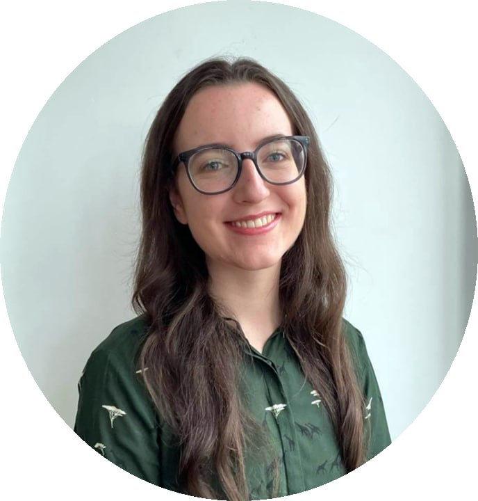
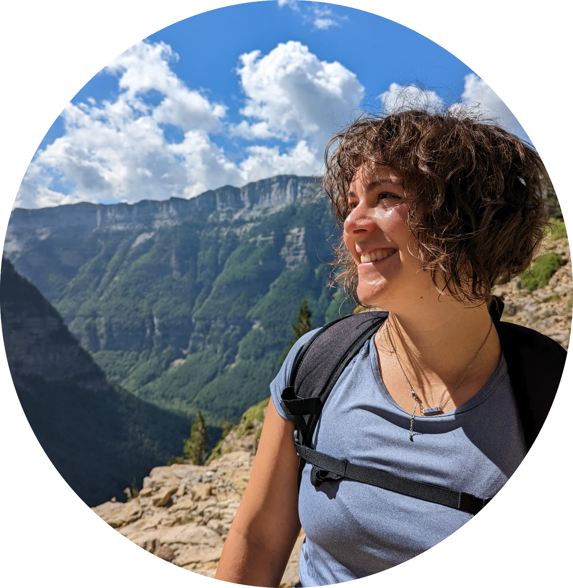

<button onclick="topFunction()" id="myBtn" title="Go to top">Back to top</button>

| **Name**                           | **Position**                    | **Institute**                              |
|------------------------------------|--------------------------------|--------------------------------------------|
| <a href="#Shirin">Shirin Moghaddam</a>                   | Chair                          | University of Limerick                     |
| <a href="#Gabriel">Gabriel Rodriques Palma</a>            | Vice-Chair                     | Maynooth University                        |
| <a href="#Kate">Kate Finucane</a>                      | Secretary                      | University College Dublin                  |
| <a href="#Nastaran">Nastaran Sharifian</a>                 | Website Manager                | University of Galway                       |
| <a href="#Catherine">Catherine Higgins</a>                  | Outreach Officer               | University College Dublin                  |
| <a href="#Emily">Emily Gribbin</a>                      | Ordinary Member                | University of Edinburgh                    |
| <a href="#Silvia">Silvia D'Angelo</a>                    | Ordinary Member                | Trinity College Dublin                     |
| <a href="#Owen">Owen McGrath</a>                       | Ordinary Member                | University of Limerick       |
| <a href="#Luke">Luke Kelly</a>                        | Ordinary Member                | University College Cork                   |
| <a href="#Fatima">Fatima-Zahra Jaouimaa</a>              | Industry-representative        | Lillys Pharmacy & Health Store    |
| <a href="#James">James Sweeney</a>                      | ISA representative             | University of Limerick                     |
| <a href="#Autumn">Autumn O'Donnell</a>                   | Ordinary Member                | University College Cork                            |

 

##  Shirin Moghaddam -- Chair
I obtained my PhD in Statistics from National University of Ireland, Galway after I had finished my Bachelor and Master degree in Statistics at the University of Tehran, Iran. Following my PhD, I joined the prostate cancer research group in UCD Conway Institute as a postdoctoral research fellow and worked on accurate grading and staging of prostate cancer. I am currently Lecturer in Statistics & Data Science in University of Limerick. My research interests include Survival analysis, Bayesian approach and Machine learning, in particular, their application in cancer research.

 

##  Gabriel Rodrigues Palma -- Vice-Chair
I graduated with first-class honours BSc in Biological Sciences from the University of São Paulo. Since starting my undergraduate degree, I have participated in several statistics, mathematical modelling, and machine learning projects. Thanks to these opportunities, I love being involved in multidisciplinary projects focusing on ecological and entomological research. I am a PhD researcher in Statistical Ecology at the Hamilton Institute of Maynooth University, funded by Science Foundation Ireland’s Centre for Research Training in Foundations of Data Science programme. My PhD project is “Statistical Modelling and machine learning applied to automating animal monitoring systems”. See my personal [webpage](https://gabrielrpalma.com).

 

##  Kate Finucane -- Secretary

I am Kate Finucane, a PhD researcher in the School of Mathematics and Statistics at University College Dublin. My research focuses on missing data imputation techniques using Bayesian methods, with applications to metabolomics. I hold a bachelor's degree in Physics and Astrophysics from Trinity College Dublin and a master's degree in Data and Computational Science from University College Dublin. I am also very passionate about scientific communication - I believe the public should be able to learn about the science they are funding! I am currently a producer of the Pint of Science Ireland podcast and have been involved in other podcasts, productions, and events in the past.

 

##  Catherine Higgins -- Outreach Officer
My name is Catherine Higgins and I’m a PhD student in Statistics at University College Dublin, funded by the SFI CRT in Genomics Data Science. I graduated from the University of Galway (formerly NUI Galway) in 2021 with a BSc in Financial Mathematics and Economics. My research area is functional data analysis and my PhD is focused on the development of methods for gene regulatory network construction from high-throughput time course data.

 

##  Silvia D'Angelo -- Ordinary Member
Hi! My name is Silvia and I am a lecturer in the School of Computer Science and Statistics, Trinity College Dublin. My research involves developing novel statistical methodology for various types of multidimensional data. I quite enjoy working on data-related problems and over the years I have had experience with many different types of data, such as social networks, metabolomic or genomic data. Outside of Statistics, I am a hiking and tag rugby enthusiast and enjoy every sort of outdoor activity. See my personal [webpage](https://silviadangelo.github.io/).

 

##  Fatima-Zahra Jaouimaa -- Industry representative
Hi, I am Fatima Jaouimaa and I’m a PhD student in Statistics at the University of Limerick. I graduated with a BSc in Economics and Mathematical Sciences from the same university. My research area is survival analysis and in particular, I’m looking at multi-parameter regression in this setting.

 

##  Emily Gribbin -- Ordinary Member
My name is Emily Gribbin and I am a Mathematics PhD student from the Mathematical Sciences Research Centre at Queen’s University Belfast, specialising in statistical methods for single-molecule imaging. I graduated from Queen’s University Belfast in 2022 with an MSci in Mathematics with Statistics and Operational Research. I am currently collaborating with the OCTOPUS Group from the Central Laser Facility in the Science and Technology Facilities Council to improve the efficiency of Fluorescence Localisation Imaging with Photobleaching (FLImP) using  reversible jump Markov chain Monte Carlo and hidden Markov models.

 

##  Luke Kelly -- Ordinary Member
I joined UCC in 2022 as a lecturer in statistics after postdoctoral positions in France and the United Kingdom. I am interested in developing statistical methodology and computational tools for phylogenetic inference and other applied problems. My personal webpage [https://lukejkelly.github.io] has more details of my academic background and research interests.

 

##  Autumn O’Donnell -- Ordinary Member
My name is Autumn O’Donnell and I’m a PhD student in Statistics at University College Cork, funded by the Human Capital Initiative Pillar 1. I graduated from the University College Cork in 2021 with an MSc in Data Science and Analytics and have a BEng in Biomedical Engineering from Cork Institute of Technology (now Munster Technological University). My research area is machine learning for survival analysis and my PhD is focused on the use of machine learning methodologies for incorporating genomic data into survival analysis for prostate cancer prognosis.

 

## Past Executive Committees
  * [2018-2019](/pastcommittees/committee-2018-2019/)

  * [2019-2020](/pastcommittees/committee-2019-2020/)

  * [2020-2021](/pastcommittees/committee-2020-2021/)

  * [2021-2022](/pastcommittees/committee-2021-2022/)
  
  * [2022-2023](/pastcommittees/committee-2022-2023/)
  
  * [2023-2024](/pastcommittees/committee-2023-2024/)

