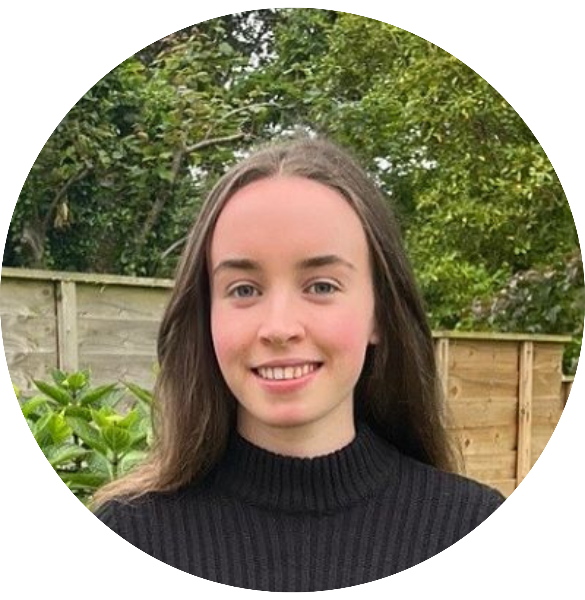
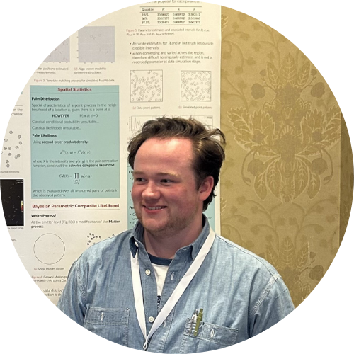

<button onclick="topFunction()" id="myBtn" title="Go to top">Back to top</button>

| **Name**                           | **Position**                    | **Institute**                              |
|------------------------------------|--------------------------------|--------------------------------------------|
| <a href="#Gabriel">Gabriel Rodriques Palma</a>                   | Chair                          | Maynooth University                     |
| <a href="#Autumn">Autumn O'Donnell</a>            | Vice-Chair                     | University of Galway                         |
| <a href="#Catherine">Catherine Higgins</a>                     | Secretary                      | University College Dublin                  |
| <a href="#Nastaran">Nastaran Sharifian</a>                 | Website Manager                | University of Galway                       |
| <a href="#Emily">Emily Gribbin</a>                  | Outreach Officer               | Queen’s University Belfast                  |
| <a href="#Rafael">Rafael de Andrade Moral</a>                     | ISA representative             |  Maynooth University                      |
| <a href="#Luke">Luke Kelly</a>                        | Ordinary Member                | University College Cork                   |
| <a href="#Laura">Laura Byrne</a>                      | Ordinary Member                | Trinity College Dublin                    |
| <a href="#Maeve">Maeve Upton </a>                       | Ordinary Member                | University of Limerick       |
| <a href="#Jack">Jack Peyton</a>                    | Ordinary Member                | Queen's University Belfast                     |

 

##  Gabriel Rodrigues Palma -- Chair
I graduated with first-class honours BSc in Biological Sciences from the University of São Paulo. Since starting my undergraduate degree, I have participated in several statistics, mathematical modelling, and machine learning projects. Thanks to these opportunities, I love being involved in multidisciplinary projects focusing on ecological and entomological research. I am a PhD researcher in Statistical Ecology at the Hamilton Institute of Maynooth University, funded by Science Foundation Ireland’s Centre for Research Training in Foundations of Data Science programme. My PhD project is “Statistical Modelling and machine learning applied to automating animal monitoring systems”. See my personal [webpage](https://gabrielrpalma.com).

 

##  Autumn O’Donnell -- Vice-Chair
My name is Autumn O’Donnell and I’m a PhD student in Statistics at University College Cork, funded by the Human Capital Initiative Pillar 1. I graduated from the University College Cork in 2021 with an MSc in Data Science and Analytics and have a BEng in Biomedical Engineering from Cork Institute of Technology (now Munster Technological University). My research area is machine learning for survival analysis and my PhD is focused on the use of machine learning methodologies for incorporating genomic data into survival analysis for prostate cancer prognosis.

 

##  Catherine Higgins -- Secretary
My name is Catherine Higgins and I’m a PhD student in Statistics at University College Dublin, funded by the SFI CRT in Genomics Data Science. I graduated from the University of Galway (formerly NUI Galway) in 2021 with a BSc in Financial Mathematics and Economics. My research area is functional data analysis and my PhD is focused on the development of methods for gene regulatory network construction from high-throughput time course data.

 

##  Nastaran Sharifian -- Website Manager

I'm currently a postdoctoral researcher at the School of Mathematical and Statistical Sciences, University of Galway. My research focuses on longitudinal data analysis. I am working on HealIntel Project, With a focus on longitudinal functional data analysis. I finished a postdoc role on Statistical Learning, with a focus on Neural Networks, at the University of Limerick, Ireland on September 30, 2023. Before starting my first post doc , I was a Lecturer in Statistics, at Shahid Beheshti University. I have over 10 years of experience in research and lecturing a diverse array of statistical content. I finished my PhD and MSc degree, respectively, in Statistics and Mathematical Statistics, from Shahid Beheshti University, Tehran, Iran. I have worked on the longitudinal mixed data, and extended the inflated and mixture models for count, continuous, and ordinal correlated responses. 

 

##  Emily Gribbin -- Outreach Officer
My name is Emily Gribbin and I am a Mathematics PhD student from the Mathematical Sciences Research Centre at Queen’s University Belfast, specialising in statistical methods for single-molecule imaging. I graduated from Queen’s University Belfast in 2022 with an MSci in Mathematics with Statistics and Operational Research. I am currently collaborating with the OCTOPUS Group from the Central Laser Facility in the Science and Technology Facilities Council to improve the efficiency of Fluorescence Localisation Imaging with Photobleaching (FLImP) using  reversible jump Markov chain Monte Carlo and hidden Markov models.

 

##  Luke Kelly -- Ordinary Member
I joined UCC in 2022 as a lecturer in statistics after postdoctoral positions in France and the United Kingdom. I am interested in developing statistical methodology and computational tools for phylogenetic inference and other applied problems. My personal webpage [https://lukejkelly.github.io] has more details of my academic background and research interests.

 

##  Laura Byrne -- Ordinary Member
Hey! I'm Laura and I'm currently a postdoctoral researcher in the ADAPT Centre and the School of Computer Science and Statistics at Trinity College Dublin. I graduated from Maynooth University in 2020 with a BSc in Computer Science and Statistics and from Trinity College Dublin in 2025 with a PhD in Statistics. My research currently centres around the use of regression models for correlated responses and the design of experiments. My work has always been motivated by environmental concerns, particularly the facilitation of natural ecosystems whilst accommodating human needs (like increasing biodiversity in agronomic spaces). Despite my love of the natural world, you'll usually find me indoors with headphones and a game or book in my hands!

 

##  Maeve Upton -- Ordinary Member
My name is Maeve Upton. I am a postdoctoral researcher specialising in statistical modelling, employing spatial temporal models with Bayesian frameworks. My current research focuses on developing statistical models to accurately estimate real-time power generation capacity of renewable energy sources in Ireland. I graduated from Trinity College Dublin in 2018 with a BSc in Physics and Astrophysics, followed by a PhD in Statistics in 2023 from Maynooth University. My PhD project developed a series of statistical models to analyse historical sea level records using proxy data from salt marshes and Bayesian Hierarchical techniques.

 

##  Jack Peyton -- Ordinary Member
My name is Jack Peyton, and I am a PhD student in Mathematics at Queen's University Belfast, where I specialise in developing statistical methods for single molecule localisation microscopy. I graduated from Queen's with an MSci in Mathematics. Currently, I work with colleagues in the OCTOPUS Group at the UK Central Laser Facility to develop statistically driven methods of analysing single molecule localisation data, with a particular focus in spatial modelling.

 

## Past Executive Committees
  * [2018-2019](/pastcommittees/committee-2018-2019/)

  * [2019-2020](/pastcommittees/committee-2019-2020/)

  * [2020-2021](/pastcommittees/committee-2020-2021/)

  * [2021-2022](/pastcommittees/committee-2021-2022/)
  
  * [2022-2023](/pastcommittees/committee-2022-2023/)
  
  * [2023-2024](/pastcommittees/committee-2023-2024/)
  
  * [2024-2025](/pastcommittees/committee-2024-2025/)

