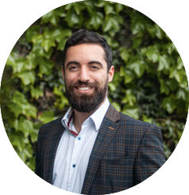
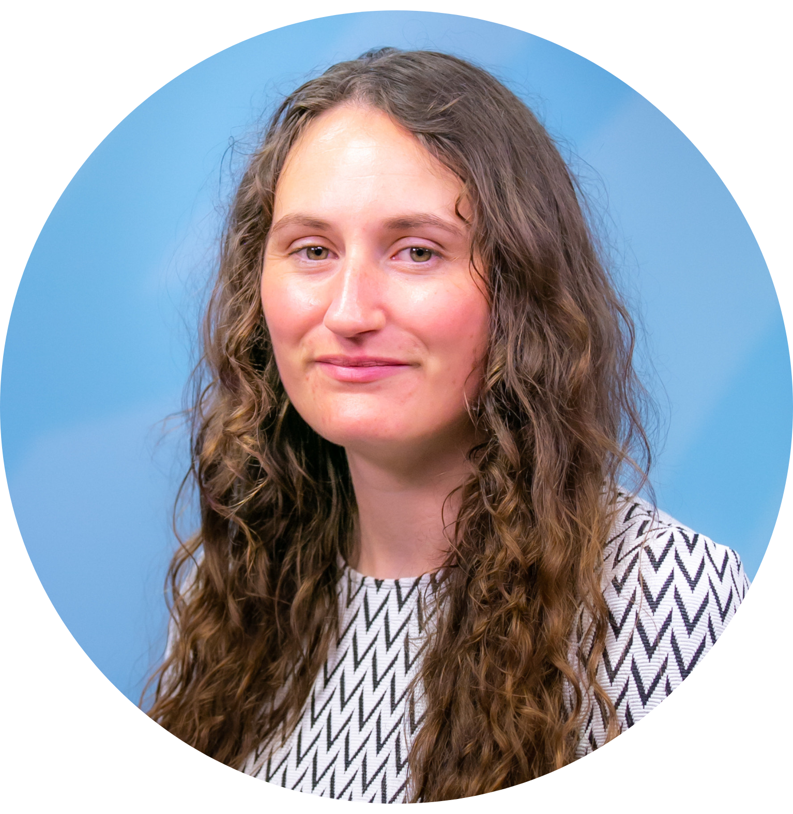
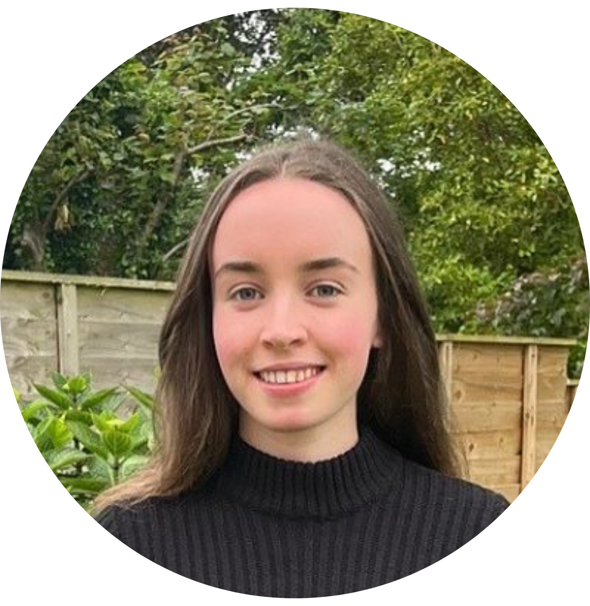
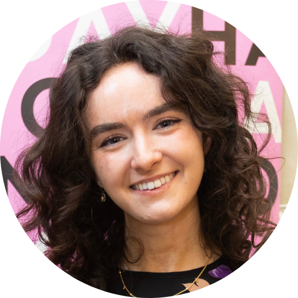
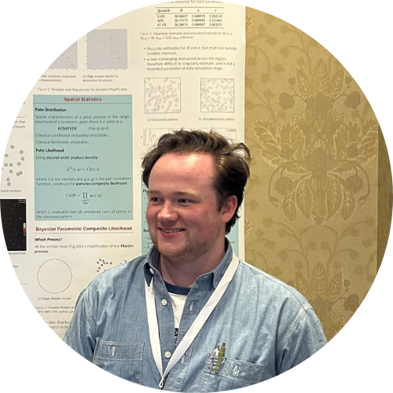

<button onclick="topFunction()" id="myBtn" title="Go to top">Back to top</button>

| **Name**                           | **Position**                    | **Institute**                              |
|------------------------------------|--------------------------------|--------------------------------------------|
| <a href="#Gabriel">Gabriel Rodriques Palma</a>                   | Chair                          | Maynooth University                     |
| <a href="#Autumn">Autum Johnson</a>            | Vice-Chair                     | University of Galway                         |
| <a href="#Catherine">Catherine Higgins</a>                     | Secretary                      | University College Dublin                  |
| <a href="#Nastaran">Nastaran Sharifian</a>                 | Website Manager                | University of Galway                       |
| <a href="#Emily">Emily Gribbin</a>                  | Outreach Officer               | Queen’s University Belfast                  |
| <a href="#Rafael">Rafael de Andrade Moral</a>                     | ISA representative             |  Maynooth University                      |
| <a href="#Laura">Laura Byrne</a>                      | Ordinary Member                | University College Cork                   |
| <a href="#Maeve">Maeve Upton </a>                       | Ordinary Member                | University of Limerick       |
| <a href="#Jack">Jack Peyton</a>                    | Ordinary Member                | Queen's University Belfast                     |
| <a href="#Szymon">Szymon Urbas</a>                    | Ordinary Member                |  Maynooth University                     |
| <a href="#Cornelius">Cornelius Fritz</a>                    | Ordinary Member                | Trinity College Dublin                     |
| <a href="#Rachel">Rachel McInerney </a>                        | Ordinary Member                | Maynooth University                    |

 

##  Gabriel Rodrigues Palma -- Chair
I graduated with first-class honours BSc in Biological Sciences from the University of São Paulo. Since starting my undergraduate degree, I have participated in several statistics, mathematical modelling, and machine learning projects. Thanks to these opportunities, I love being involved in multidisciplinary projects focusing on ecological and entomological research. I am a PhD researcher in Statistical Ecology at the Hamilton Institute of Maynooth University, funded by Science Foundation Ireland’s Centre for Research Training in Foundations of Data Science programme. My PhD project is “Statistical Modelling and machine learning applied to automating animal monitoring systems”. See my personal [webpage](https://gabrielrpalma.com).

 

##  Autum Johnson -- Vice-Chair
My name is Autum Johnson and I'm a Postdoctoral Researcher in Statistics at the University of Galway. I am currently working on the EU-funded SMARTSHAPE project, which focuses on non-invasive continuous blood pressure monitoring. My broad research focus is in medical and health statistics, with specific interests in survival analysis, clinical trial design, and the implementation of machine learning in healthcare. My PhD is from University College Cork, where I graduated in 2025. My research focused on applying machine learning to incorporate genomic data into survival analysis for prostate cancer prognosis.

 

##  Catherine Higgins -- Secretary
My name is Catherine Higgins and I’m a postdoctoral researcher in Statistics at University College Dublin. I completed my PhD at University College Dublin as part of the Research Ireland Centre for Research Training in Genomics Data Science. Prior to this, I graduated from the University of Galway with a BSc in Financial Mathematics and Economics. My research focuses on spatial functional data analysis.

 

##  Nastaran Sharifian -- Website Manager

I am a Postdoctoral Researcher at the School of Mathematical and Statistical Sciences, University of Galway. I have recently been awarded a Research Ireland Public Service Fellowship. From October 2026, I will lead a project hosted by the Food Safety Authority of Ireland (FSAI), applying statistical methods to predict temporal and geographical risks of food and drinking-water non-compliance due to chemical hazards. My research interests include longitudinal and functional data analysis, statistical learning, neural networks, and developing models for correlated responses. Previously, I worked as a Postdoctoral Researcher at the University of Limerick and as a Lecturer in Statistics at Shahid Beheshti University, where I completed my PhD in Statistics and MSc in Mathematical Statistics.

 

##  Emily Gribbin -- Outreach Officer
My name is Emily Gribbin and I am a Mathematics PhD student from the Mathematical Sciences Research Centre at Queen’s University Belfast, specialising in statistical methods for single-molecule imaging. I graduated from Queen’s University Belfast in 2022 with an MSci in Mathematics with Statistics and Operational Research. I am currently collaborating with the OCTOPUS Group from the Central Laser Facility in the Science and Technology Facilities Council to improve the efficiency of Fluorescence Localisation Imaging with Photobleaching (FLImP) using  reversible jump Markov chain Monte Carlo and hidden Markov models.

 

##  Laura Byrne -- Ordinary Member
Hey! I’m Laura and I’m currently a lecturer for Statistics at University College Cork. I graduated from Maynooth University in 2020 with a BSc in Computer Science and Statistics and from Trinity College Dublin in 2025 with a PhD in Statistics. My research currently centres around the use of regression models for correlated responses and the design of experiments. My work has always been motivated by environmental concerns, particularly the facilitation of natural ecosystems whilst accommodating human needs (like increasing biodiversity in agronomic spaces). Despite my love of the natural world, you’ll usually find me indoors with headphones and a game or book in my hands!

 

##  Maeve Upton -- Ordinary Member
My name is Maeve Upton. I am a postdoctoral researcher specialising in statistical modelling, employing spatial temporal models with Bayesian frameworks. My current research focuses on developing statistical models to accurately estimate real-time power generation capacity of renewable energy sources in Ireland. I graduated from Trinity College Dublin in 2018 with a BSc in Physics and Astrophysics, followed by a PhD in Statistics in 2023 from Maynooth University. My PhD project developed a series of statistical models to analyse historical sea level records using proxy data from salt marshes and Bayesian Hierarchical techniques.

 

##  Jack Peyton -- Ordinary Member
My name is Jack Peyton, and I am a PhD student in Mathematics at Queen's University Belfast, where I specialise in developing statistical methods for single molecule localisation microscopy. I graduated from Queen's with an MSci in Mathematics. Currently, I work with colleagues in the OCTOPUS Group at the UK Central Laser Facility to develop statistically driven methods of analysing single molecule localisation data, with a particular focus in spatial modelling.

 

##  Szymon Urbas -- Ordinary Member
I'm a lecturer in statistics at Maynooth University. I completed my PhD at Lancaster University as part of the STOR-i Centre for Doctoral Training. Prior to my current role, I worked as a postdoc at University College Dublin. My research interests are fairly wide but generally involve bespoke statistical models and computationally intensive inference methods. 
          
 
            
##  Cornelius Fritz -- Ordinary Member
I am an Assistant Professor in Statistics at Trinity College Dublin. My research lies at the intersection of statistical methodology, political science, and network analysis, where I develop scalable models and methods for network data. My work is motivated by applications in the social sciences, such as analyzing patterns of political alliances, arms trade, legislative behavior, and media co-mentions. 

 

##  Rachel McInerney -- Ordinary Member
Rachel McInerney is a(n actually young) PhD student at Maynooth University. Her research focuses on advancing statistical methods for fisheries management, because counting fish is apparently harder than it sounds. She is funded by Research Ireland’s Enterprise Partnership Scheme and collaborates with the Canadian Government. Rachel graduated from Maynooth University in 2024 with a BSc in Applied Mathematics and Statistics and has been unable to escape Maynooth ever since.
          
 

## Past Executive Committees
  * [2018-2019](/pastcommittees/committee-2018-2019/)

  * [2019-2020](/pastcommittees/committee-2019-2020/)

  * [2020-2021](/pastcommittees/committee-2020-2021/)

  * [2021-2022](/pastcommittees/committee-2021-2022/)
  
  * [2022-2023](/pastcommittees/committee-2022-2023/)
  
  * [2023-2024](/pastcommittees/committee-2023-2024/)
  
  * [2024-2025](/pastcommittees/committee-2024-2025/)
  
  * [2025-2026](/pastcommittees/committee-2025-2026/)

